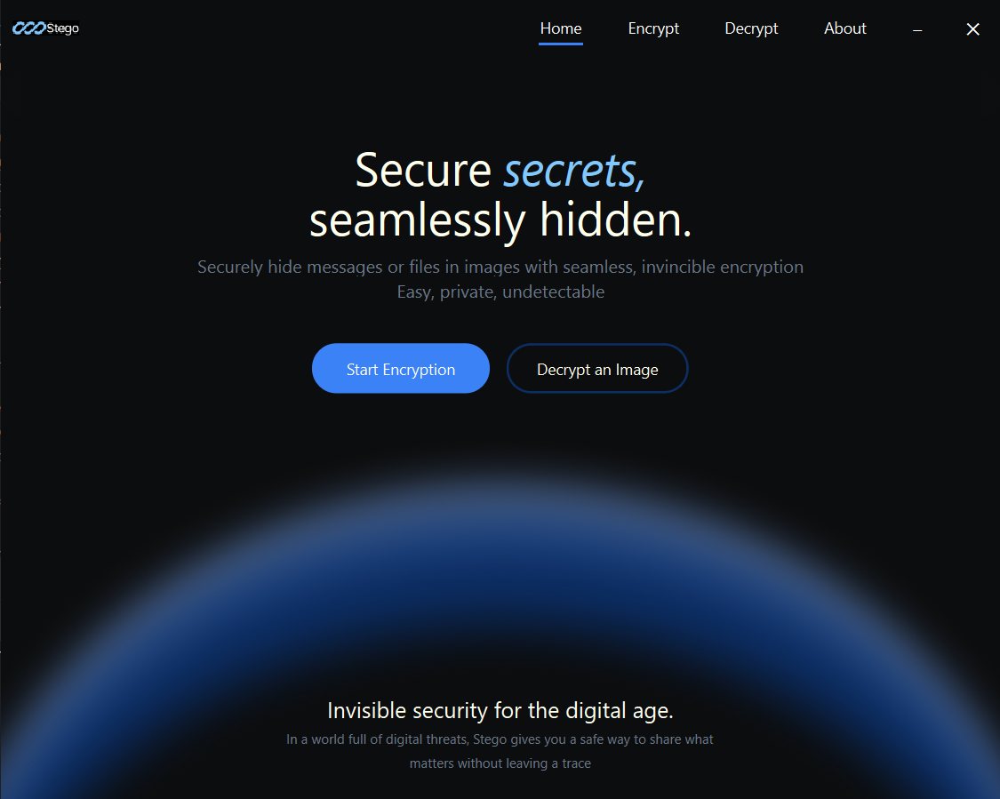
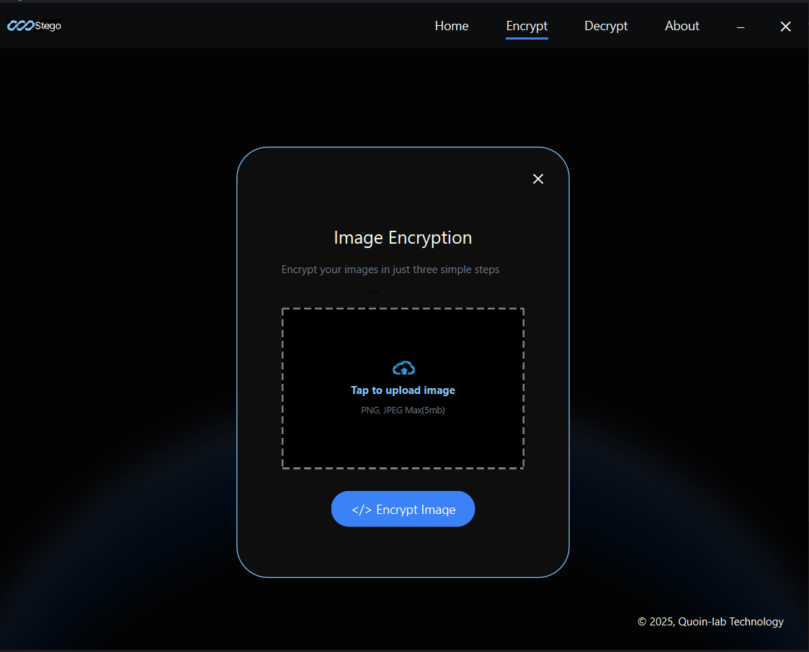
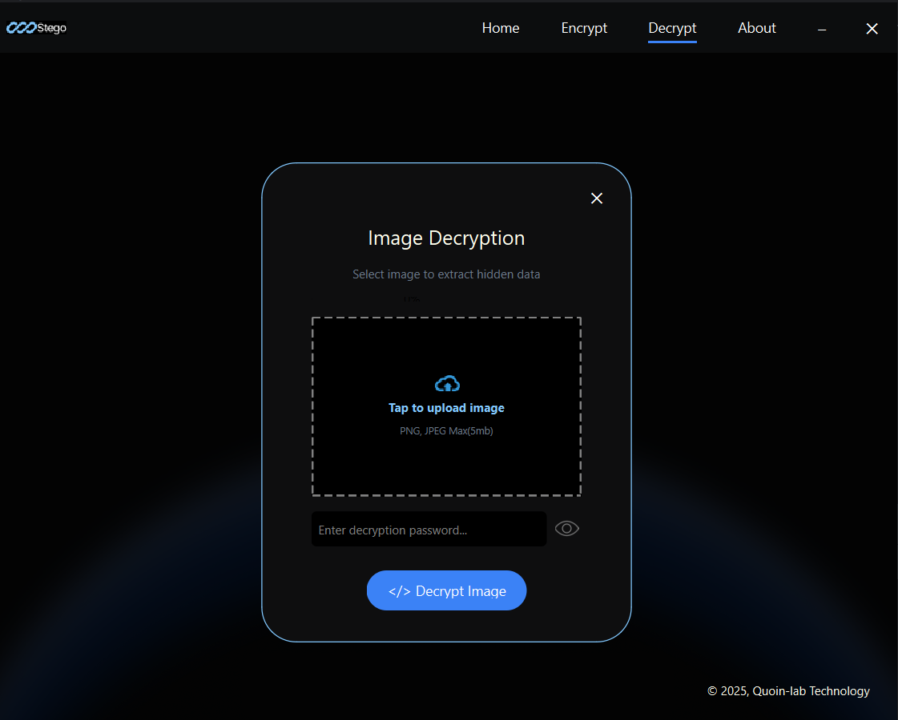
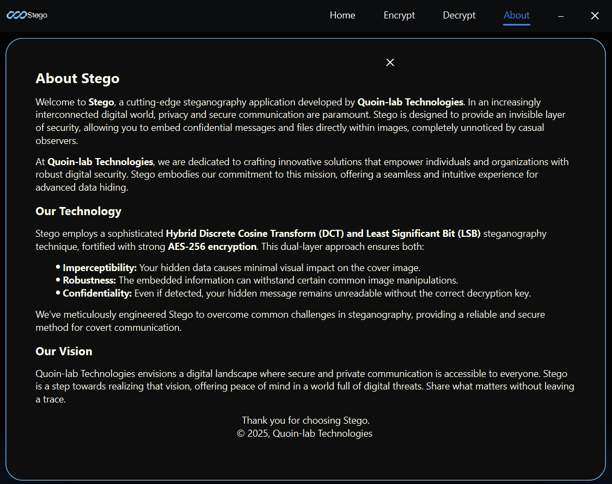

# Stego: Invisible Security for the Digital Age 🔒

## Overview

Welcome to **Stego**, a robust and intuitive steganography application designed to embed and extract secret messages and files within digital images. In an era where digital privacy is paramount, Stego offers an unseen layer of security, allowing you to communicate confidential information without drawing unwanted attention.

Built with Python and PySide6 for the graphical user interface, Stego employs a sophisticated hybrid steganography technique combined with strong encryption to ensure both imperceptibility and confidentiality of your hidden data.

## Features ✨

* **Hybrid Steganography:** Utilizes a powerful combination of **Discrete Cosine Transform (DCT)** and **Least Significant Bit (LSB)** techniques to embed data.
    * **DCT Domain Embedding:** The core secret data is hidden within the mid-frequency coefficients of the image's Y (luminance), Cr, and Cb (chrominance) channels. This provides better resistance against common image compressions and manipulations.
    * **LSB for Header:** A small, critical header (containing the encrypted data's length) is embedded using the LSB method in the spatial domain for reliable extraction.
* **AES-256 Encryption:** All secret data is encrypted using **AES-256 (Advanced Encryption Standard)** in CBC (Cipher Block Chaining) mode. This ensures that even if the hidden message's presence is detected, its content remains secure and unreadable without the correct password.
* **Metadata Embedding:** Supports embedding essential metadata such as:
    * **Data Type:** Distinguishes between hidden text and binary files.
    * **Original Filename:** Retains the original name of embedded files for seamless extraction and saving.
    * **File Extension:** Preserves the original file extension.
* **Broad File Support:** Successfully embeds and extracts:
    * Plain text messages.
    * `.txt` files.
    * `.docx` files.
    * Other generic binary files.
* **User-Friendly Interface:** A sleek and intuitive graphical user interface (GUI) built with **PySide6** makes the embedding and extraction process straightforward for any user.
* **Cross-Platform:** Developed in Python, making it compatible across various operating systems (Windows, macOS, Linux).

## Screenshots 📸

Get a glimpse of Stego in action!

| Home Screen | Encryption Screen |
| :---------------------------------: | :---------------------------------: |
|  |  |

| Decryption Screen | About Screen |
| :---------------------------------: | :---------------------------------: |
|  |  |

## How it Works (Under the Hood) 

1.  **Preparation:**
    * The secret message (text or file) is first **Base64 encoded** to ensure safe JSON serialization.
    * It's then encapsulated in a JSON payload along with metadata (e.g., `{"type": "file", "filename": "secret.docx", "content": "base64_encoded_data"}`).
    * This JSON payload is **compressed using `zlib`** for maximum capacity efficiency.
    * Finally, the compressed payload is **encrypted using AES-256** with a password-derived key.
2.  **Embedding:**
    * The cover image is converted to the YCrCb color space.
    * It's divided into 8x8 blocks.
    * For each block, the Discrete Cosine Transform (DCT) is applied to its Y, Cr, and Cb channels.
    * Specific low-frequency AC coefficients within these DCT blocks are selected.
    * Each bit of the encrypted payload is embedded into the Least Significant Bit (LSB) of these *quantized* DCT coefficients. A `quantization_step` (default 16) ensures robustness against minor image alterations.
    * The modified DCT blocks are then transformed back to pixel data using Inverse DCT (IDCT) and re-merged.
    * The total length of the encrypted payload is additionally embedded into the LSBs of the first few pixels of the final stego image, acting as a crucial header for extraction.
3.  **Extraction:**
    * The process is reversed: the length header is first read from the stego image's LSBs.
    * Bits are extracted from the DCT coefficients of the image's Y, Cr, and Cb channels using the same quantization and coefficient selection method used for embedding.
    * These extracted bits form the encrypted payload.
    * The payload is then **decrypted using AES-256** with the user-provided password.
    * The decrypted data is **decompressed using `zlib`**.
    * Finally, the JSON payload is parsed, and the original secret message (text or file content) is retrieved and **Base64 decoded**.

## Limitations & Future Work 🚧

While highly effective for various data types, the current implementation has some limitations:

* **PDF Robustness:** Embedding and reliably extracting highly compressed and complex binary files like PDFs can still be challenging due to their extreme sensitivity to bit-level corruption. Even minor errors introduced during the steganography process can lead to decompression failures.
* **Error Correction Codes (ECC):** Implementing robust error correction codes (e.g., Reed-Solomon, convolutional codes) would significantly improve the reliability of data recovery, especially for noisy channels or less robust image modifications.
* **Adaptive Embedding:** More advanced techniques could analyze image regions and adapt embedding strength to minimize visual distortion while maximizing robustness.
* **Performance Optimization:** For very large images or files, processing times could be optimized.
* **User-Defined Quantization:** Allowing users to adjust the `quantization_step` from the UI could provide more flexibility between imperceptibility and robustness.

These areas represent exciting opportunities for future research and development!

## Getting Started 🚀

Follow these steps to get Stego up and running on your local machine.

### Prerequisites

* Python 3.8+
* `pip` (Python package installer)

### Installation

1.  **Clone the repository:**

    ```bash
    git clone [https://github.com/your-username/Stego.git](https://github.com/your-username/Stego.git)
    cd Stego
    ```

2.  **Create a virtual environment (recommended):**

    ```bash
    python -m venv venv
    ```

3.  **Activate the virtual environment:**

    * **Windows:**
        ```bash
        .\venv\Scripts\activate
        ```
    * **macOS/Linux:**
        ```bash
        source venv/bin/activate
        ```

4.  **Install dependencies:**

    ```bash
    pip install PySide6 opencv-python numpy cryptography Pillow
    ```
    * `PySide6`: For the GUI.
    * `opencv-python`: For image processing (DCT, IDCT, color space conversions).
    * `numpy`: For numerical operations with image data.
    * `cryptography`: For AES encryption/decryption.
    * `Pillow`: (Often a dependency of `opencv-python` but good to explicitly mention or check if needed for image loading beyond OpenCV's capabilities for certain formats.)

### Project Structure

The project follows a modular structure for clarity and maintainability:
```
Steg/
├── assets/                 # Contains UI icons, background images, and other visual assets.
│   ├── steg_bg3.png
│   ├── steg_logo.png
│   ├── upload-icon-3.png
│   ├── delete_icon.png
│   ├── file_icon.png
│   ├── show.png
│   ├── hide_.png
│   ├── arrow_left.png
│   └── Group.png
├── backend/                # Core steganography and encryption logic.
│   ├── init.py
│   ├── encryption.py       # Contains the AES encryption/decryption class.
│   ├── steganography.py    # Implements the hybrid DCT-LSB embedding/extraction.
│   └── ...                 # (Other utility files if any)
├── frontend/               # PySide6 UI components and screen definitions.
│   ├── init.py         # Imports and organizes frontend modules.
│   ├── about.py            # The "About" screen UI.
│   ├── base_widget.py      # Base class for common widget functionalities (e.g., background).
│   ├── decrypt.py          # The decryption screen UI and logic.
│   ├── encrypt.py          # The encryption screen UI and logic.
│   └── home.py             # The main home screen UI.
└── main.py                 # The main application entry point, sets up the window and navigates screens.
```
## Usage 💻

After following the installation steps and activating your virtual environment:

1.  **Run the application:**

    ```bash
    python main.py
    ```

2.  **Navigate the UI:**
    * From the **Home Screen**, choose to "Encrypt" or "Decrypt" data.
    * On the **Encryption Screen**:
        * Upload a PNG or JPEG cover image.
        * Select whether to embed a text message or a document (e.g., `.txt`, `.docx`).
        * Provide an encryption password.
        * Click "Embed" and choose the output location for your stego image (`.png` format is required for data integrity).
    * On the **Decryption Screen**:
        * Upload the stego image (`.png` format).
        * Provide the correct decryption password.
        * Click "Decrypt".
        * If text was embedded, it will appear in the text area, and you'll have a "Copy Text" option.
        * If a file was embedded, a message will indicate a binary file, and you'll have a "Save File" option to download it.

## Contributing 🤝

Contributions are welcome! If you have suggestions for improvements or bug fixes, feel free to open an issue or submit a pull request.

## License 📄

This project is licensed under the MIT License - see the `LICENSE` file for details. (You might need to create a `LICENSE` file in your repository if you haven't already).

## Contact 📧

For any inquiries or feedback, please reach out to meshelleva@gmail.com or contact Quoin-lab Technologies.

---
**© 2025, Quoin-lab Technologies. All rights reserved.**
